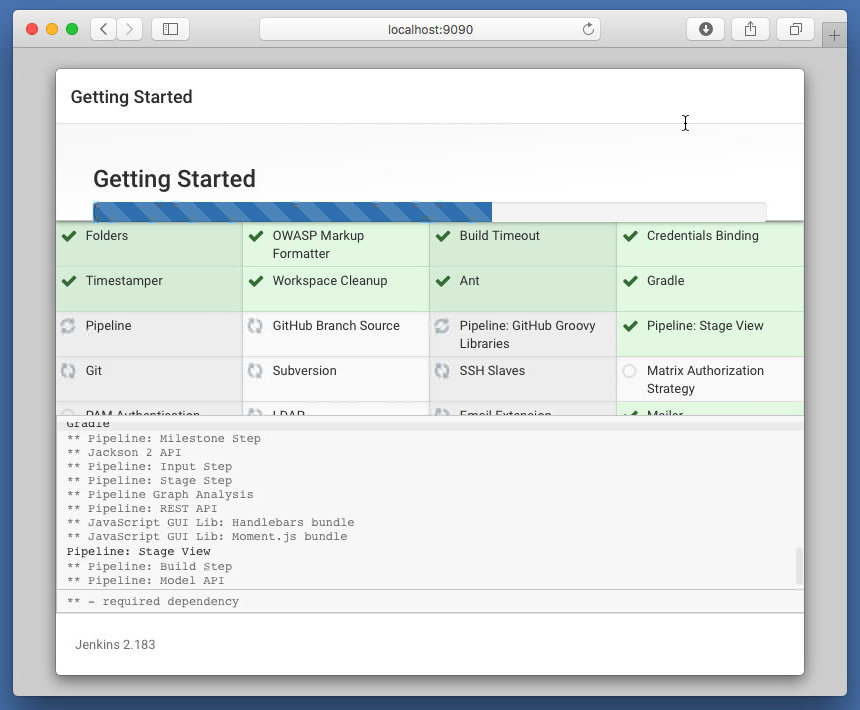

# ameyrupji.local-jenkins-setup

This repository outlines the steps to setup Jenkins reversed proxied through nginx on MacOS accessible on the local network.

## Prerequisites 

- HomeBrew installed (Installation instructions: https://www.howtogeek.com/211541/homebrew-for-os-x-easily-installs-desktop-apps-and-terminal-utilities/)
- Nginx installed (Installation instructions: https://github.com/ameyrupji-local/ameyrupji.local-nginx-setup)

## System Configuration at time of test

- macOS High Sierra - Version 10.13.6 
- Nginx - Version 1.17.1

## Installation instructions

### Brew install

These instructions are used to install Jenkins using brew

Use brew to install the nginx run the following command in a terminal: `brew install jenkins` or `brew install jenkins-lts`. I am going with the regular version in this install.


### Changing the port to 9090

Before we start Jenkins lets use the port 9090 for jenkins. Insure that the HTTP port setting is configured for port 9090 `—-httpPort=9090` in the Jenkins configuration file located at `/usr/local/Cellar/jenkins/2.x.x/homebrew.mxcl.jenkins.plist`

### Finish Jenkins installation

To have home-brew start your jenkins and restart at login run: `brew services start jenkins`


Go to `http://locahost:9090/` in the browser and finish the Jenkins installation.





Jenkins should be accessible at `http://localhost:9090`


This should also be accessible on the local network at `http://ameyrupji.local:9090` but as services increases it will be hard to remember all the ports to service mappings. It would be easy to access this using the following url `http://ameyrupji.local/jenkins` this is where nginx come in.

### Setting up Nginx

In the nginx file located at `/usr/local/etc/nginx/nginx.conf` add the following to the server listening at port `80`:

```
location /jenkins {
    proxy_set_header        Host $host:$server_port;
    proxy_set_header        X-Real-IP $remote_addr;
    proxy_set_header        X-Forwarded-For $proxy_add_x_forwarded_for;
    proxy_set_header        X-Forwarded-Proto $scheme;

    # Fix the "It appears that your reverse proxy set up is broken" error.
    proxy_pass          http://127.0.0.1:9090;
    proxy_read_timeout  90;

    proxy_redirect      http://127.0.0.1:9090 https://ameyrupji.local;

    # Required for new HTTP-based CLI
    proxy_http_version 1.1;
    proxy_request_buffering off;
    # workaround for https://issues.jenkins-ci.org/browse/JENKINS-45651
    add_header 'X-SSH-Endpoint' 'ameyrupji.local:50022' always;
}
```

This will reverse proxy the request at `http://ameyrupji.local/jenkins`. To apply these changes restart the nginx server using the command `sudo nginx -s stop` and `sudo nginx`

### Setup prefix for Jenkins

In the jenkins configurations file located at `/usr/local/Cellar/jenkins/2.x.x/homebrew.mxcl.jenkins.plist` add the following prefix argument `--prefix=/jenkins`

The final file should look like this:

```
<?xml version="1.0" encoding="UTF-8"?>
<!DOCTYPE plist PUBLIC "-//Apple//DTD PLIST 1.0//EN" "http://www.apple.com/DTDs/PropertyList-1.0.dtd">
<plist version="1.0">
  <dict>
    <key>Label</key>
    <string>homebrew.mxcl.jenkins</string>
    <key>ProgramArguments</key>
    <array>
      <string>/usr/libexec/java_home</string>
      <string>-v</string>
      <string>1.8</string>
      <string>--exec</string>
      <string>java</string>
      <string>-Dmail.smtp.starttls.enable=true</string>
      <string>-jar</string>
      <string>/usr/local/opt/jenkins/libexec/jenkins.war</string>
      <string>--httpPort=9090</string>
      <string>--prefix=/jenkins</string>
    </array>
    <key>RunAtLoad</key>
    <true/>
  </dict>
</plist>

```

To apply these changes restart the jenkins service using the command `brew services restart jenkins`


## Test 

Open Safari it by going to URL on other network computer and go to the following link: `http://ameyrupji.local/jenkins`. Enter the username and password at the authentication page the jenkins website should pull up.


## Cleanup

To uninstall jenkins:

First stop the jenkins server if it is running by running:
`brew services stop jenkins`

Using brew to uninstall Jenkins run the command: 
`brew uninstall jenkins`


## Useful Links

- https://www.macminivault.com/installing-jenkins-on-macos/
- https://mgrebenets.github.io/mobile%20ci/2015/02/01/jenkins-ci-server-on-osx
- https://wiki.jenkins.io/display/JENKINS/Jenkins+behind+an+NGinX+reverse+proxy
