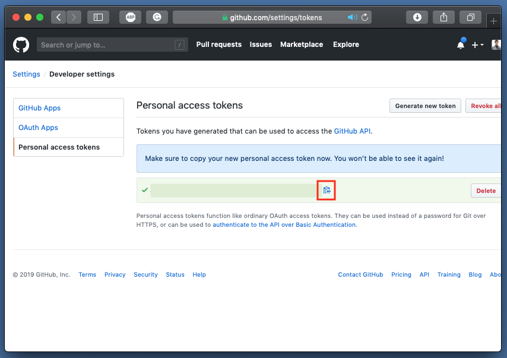
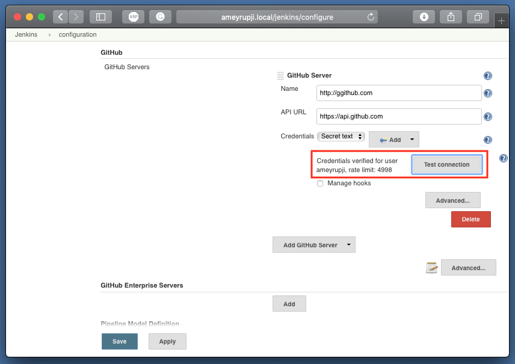

| [Home](./) ▸ **GitHub Setup** |
|-----|

# GitHub Setup

This page outlines the steps required to setup the GitHub.com connection to Jenkins server

## Prerequisites 

- Jenkins installed (Installation instructions: https://github.com/ameyrupji-local/ameyrupji.local-jenkins)
    - GitHub API Plugin installed (https://wiki.jenkins.io/display/JENKINS/GitHub+API+Plugin)

## System Configuration at time of test

- Jenkins - v2.186
    - GitHub Api Plugin - v3.11.0

## Installation instructions

### Generate GitHub.com personal access token

### Setup GitHub api plugin

## Test 

## Cleanup

- Remove the settings added above from Jenkins.
- Remove the personal access token clicking on the Delete button.

## Useful Links

- https://www.macminivault.com/installing-jenkins-on-macos/
- https://mgrebenets.github.io/mobile%20ci/2015/02/01/jenkins-ci-server-on-osx
- https://wiki.jenkins.io/display/JENKINS/Jenkins+behind+an+NGinX+reverse+proxy