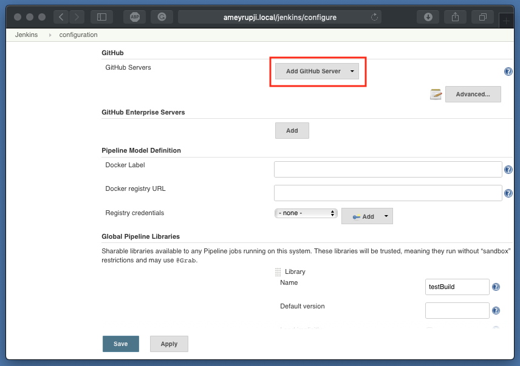

| [Home](./) ▸ **GitHub Setup** |
|-----|

# GitHub Setup

This page outlines the steps required to setup the GitHub.com connection to Jenkins server

## Prerequisites 

- Jenkins installed (Installation instructions: https://github.com/ameyrupji-local/ameyrupji.local-jenkins)
    - GitHub API Plugin installed (https://wiki.jenkins.io/display/JENKINS/GitHub+API+Plugin)

## System Configuration at time of test

- Jenkins - v2.186
    - GitHub Api Plugin - v3.11.0

## Installation instructions

### Generate GitHub.com personal access token

In the upper-right corner of any page, click your profile photo, then click `Settings`.

In the left sidebar, click `Developer settings`.

In the left sidebar, click `Personal access tokens`.

Click `Generate new token`.

Give your token a descriptive name. Select the scopes, or permissions, you'd like to grant this token. To use your token to access repositories from the command line, select `repo`. Click `Generate token`.

Click to copy the token to your clipboard. For security reasons, after you navigate off the page, you will not be able to see the token again.

### Setup GitHub Api plugin

Go to `Manage Jenkins` > `Configuration System`. Go to GitHub section a click on `Add GitHib Server`.

Add a Name for the Server and then select `Add` in Credentials. Select Kind as `Secret text`.

Click on Credentials `add`.  and add the generated token in the `Secrets` text box.

Select the added credentials and click on `Save`.

## Test 

Hit the Test Connection button and you should see the message `Credentials verified for user ameyrupji, rate limit: xxxx`.

## Cleanup

- Remove the settings added above from Jenkins.
- Remove the personal access token clicking on the Delete button.

## Useful Links

- https://help.github.com/en/articles/creating-a-personal-access-token-for-the-command-line